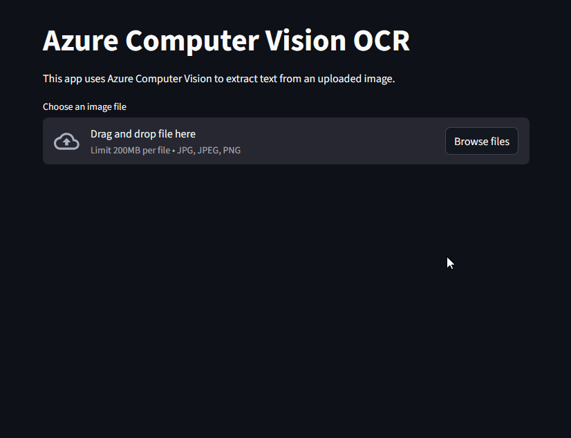

# Azure OCR Streamlit App

This is a simple Streamlit application that extracts text from uploaded images using Azure Computer Vision (Image Analysis). The app reads an image, sends it to Azure for OCR, and displays the extracted text with color-coded confidence levels.


---

## Features

- Upload an image (`.jpg`, `.jpeg`, `.png`)
- Displays the uploaded image
- Extracts text using Azure Image Analysis Read features
- Color-codes words based on confidence thresholds
- Renders results directly in Streamlit using Markdown-style formatting

---

## How It Works

1. The user uploads an image.
2. The image is converted to raw bytes for Azure.
3. Azure OCR processes the image and returns detected text and confidence scores.
4. The app maps confidence scores to colors based on thresholds defined in `sup_utils.py`.
5. Extracted text is displayed with background colors representing confidence.

---

## Notes

This project is intentionally simple and designed as a lightweight demonstration.
It requires an active Azure Computer Vision resource.
Confidence color thresholds must be defined in the sup_utils.py file.

## Running the app
This requires an active Azure Computer Vision resource. Create an azure_secrets file with variables: key & endpoint from your resource
Install dependencies using requirements.txt and run 
```
streamlit run main.py
```

